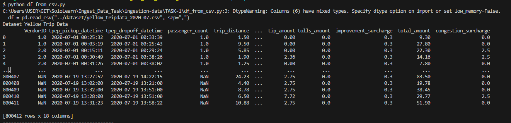

# TASK 1
1. We have already learned how to create DataFrame from files here. Now, we are going to create a DataFrame from a larger csv file on our datasets.
    1. Pertama kita buat file python yang berfungsi untuk mengakses file csv dan membuatnya menjadi sebuah dataframe, seperti yang telah saya buat yaitu file df_from_csv.py

        
    2. Kemudian Jalankan File tersebut untuk melihat hasilnya

        

2. Rename all the columns with snake_case format.
    1. Untuk mengecek nama tiap kolom pada file ada beberapa cara, untuk ini saya akan menggunakan perintah dtypes untuk melihat nama kolom pada file tersebut.

        

        
    2. Kemudian kita ubah semua nama kolom yang belum menggunakan snakecase format --> snake case format dengan syntax sebagai berikut. Kemudian kita jalankan untuk melihat hasilnya.

         

        

3. Select only 10 top of highest number of passenger_count, show only columns vendor_id, passenger_count, trip_distance, payment_type, fare_amount, extra, mta_tax, tip_amount, tolls_amount,improvement_surcharge, total_amount, congestion_surcharge from the DataFrame.

    

    

4. [Extra] Cast the data type to the appropriate value.
    1. Pertama Kita cek dahulu tipe data masing-masing kolom menggunakan dtypes.

        
    2. kemudian Kita ubah jika ada kolom yang sekiranya memiliki tipe data yang kurang sesuai dengan perintah berikut. Sehingga dapat kita lihat hasil perubahannya.
        
        

# END

