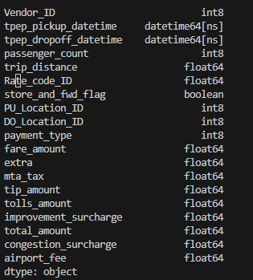

# TASK 2
1. We are going to create a DataFrame from a parquet file on our datasets. (file yellow_tripdata_2023-01.parquet)
    (mirip dengan file test.py tapi ganti format ke parquet dan tambah/import dengan library sesuai nomor selanjutnya (nomor 1-5))
2. Load the parquet file to a DataFrame with fastparquet library.

3. Clean the Yellow Trip dataset.

4. Define the data type schema when using to_sql method.
    
5. Ingest the Yellow Trip dataset to PostgreSQL

6. Count how many rows are ingested.
    (masuk ke dbeaver use count(SQL))

# Answer
Untuk menjawab semua soal tersebut, berikut tahapan yang saya lakukan:
1. Pertama kita buat file python yang berfungsi untuk mengakses file parquet dan membuatnya menjadi sebuah dataframe, seperti yang telah saya buat yaitu file df_parquet_to_postgres.py.
    Disini kita menggunakan metode fastparquet.

    

    

2. Kemudian kita perlu melakukan cleaning data dengan melakukan standarisasi format pada kolom dan tipe data dan juga melakukan sesuatu terhadap null value.
    Melakukan pengecekan nama tabel dan tipe data.

    

    Melakukan cleaning data

    

    Hasil setelah dilakukan perubahan

    


3. Setelah itu sebelum kita melakukan define schema kita perlu membuat fungsi untuk mengkoneksikannya dengan postgresql seperti gambar berikut.

    
    
    Barulah kita bisa mendefinisikan schema yang akan kita masukkan ke database postgre dan membuat membuat fungsi .to_sql untuk melakukan koneksi ke postgre.

    

4. Sebelum kita menjalankan python ini kita perlu memastikan docker desktop kita sudah berjalan dan terdapat image2 yang kita perlukan.

    

    Siapkan file docker compose yang sudah terkonfigurasi dan siap dijalankan. Pastikan file tersebut berlokasi sama dengan work directory saat ini. Kemudian lakukan perintah di bawah ini.
    
     
     ```
     docker compose <nama-file> up -d
     ```
    Namun perlu dipastikan port yang akan digunakan sedang tidak terpakai dan tidak ada docker lain yang berjalan sebelum menjalankannya.

    

    Pastikan semua container berjalan dengan melihat dengan menjalankan perintah
    ```
     docker ps
     ```
    Atau dengan melihat di aplikasi desktop.

    

    Koneksikan dbeaver dengan container yang telah terbuat.

    

    Sesuaikan konfigurasi dengan python dan file docker compose yang telah dibuat

    

    Jika sudah terkoneksi maka database akan terbentuk di dbeaver

    

5. Selanjutnya ingest file parquet ke dalam postgres yang telah di buat dengan menjalankan file python yang telah kita buat tadi.
    ```
     $ python df_parquet_to_postgres.py
    ```

    

    Cek file di database

    

    Dapat dilihat diatas bahwa file sudah masuk ke database.

6. Sekarang kita akan menghitung berapa banyak row yang ter-ingest ke database tersebut dengan menjalankan perintah berikut .

     ```
     SELECT COUNT(*) AS TOTAL_ROW FROM parquet ;
     ```
    Dapat kita lihat total row yang ter-ingest ada 100.000 row

    

# END