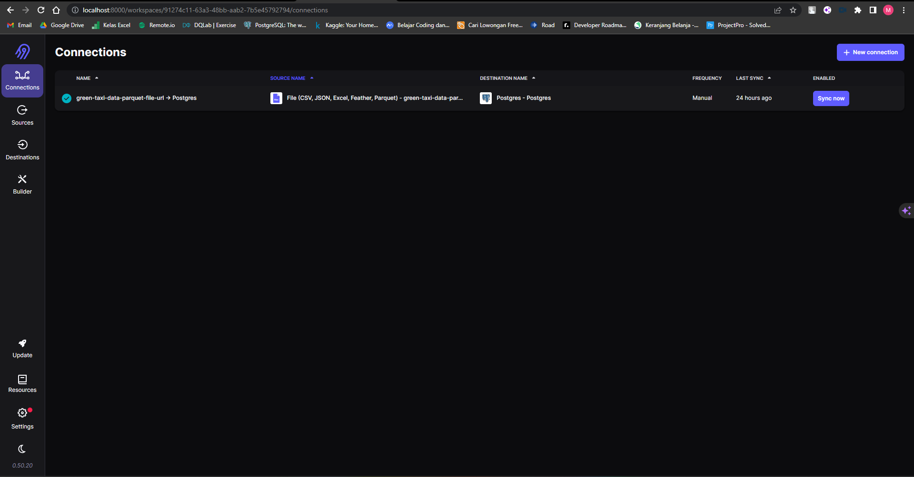
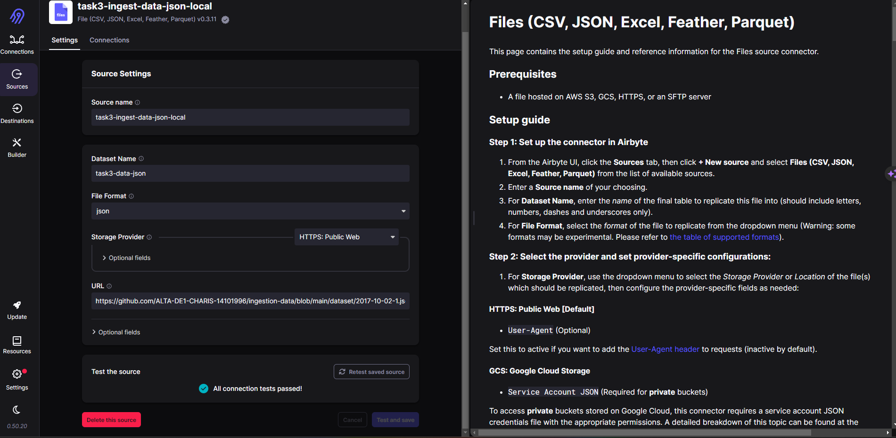
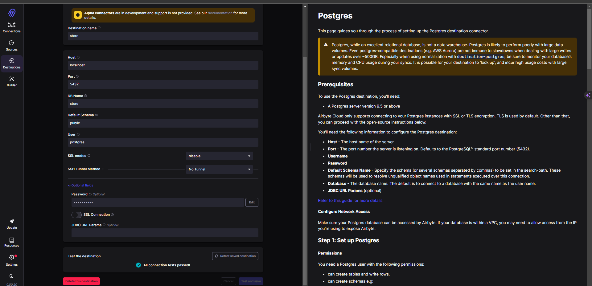
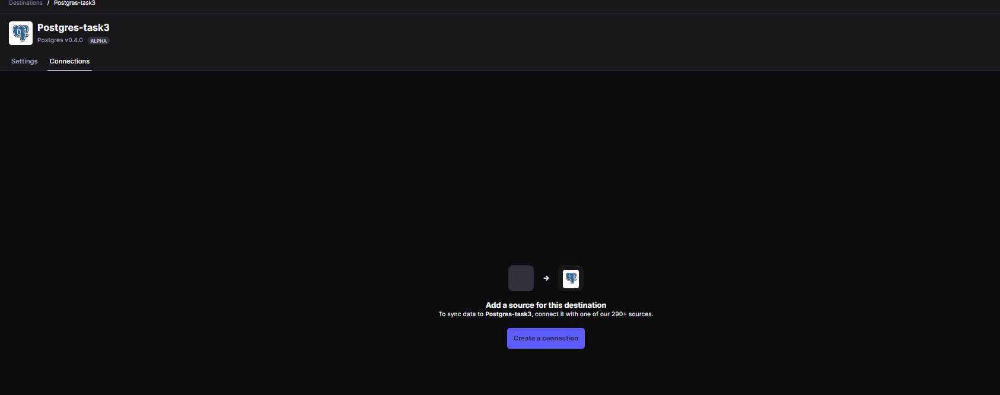
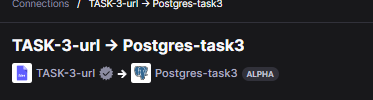
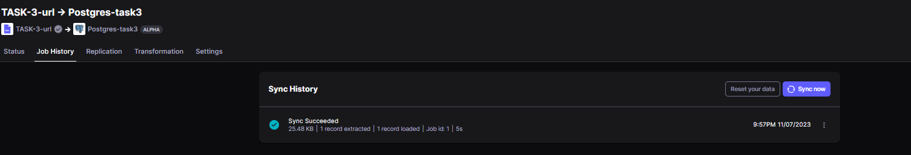
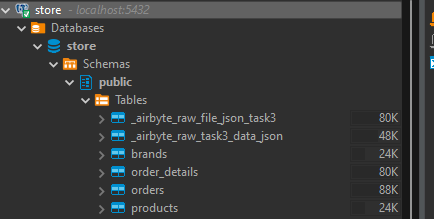
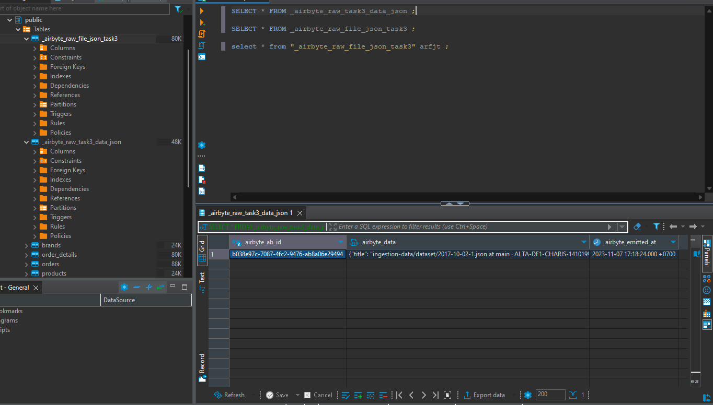

# TASK 3
1. Ingest data from local file json to Postgresql with Airbyte.


2. Count the number of rows ingested.

## Answer

1. Pertama Jalankan docker pastikan tidak ada docker lain yang sedang berjalan dan port yang akan digunakan tidak terpakai. Pastikan konfigurasi yang berada dalam file docker compose sudah sesuai terutaman untuk postgre. Masuk ke work directory dimana file docker compose tersimpan. Jalankan file docker tersebut dengan perintah 
    ```
    $ docker-compose -f docker-compose.yml up -d
    ```

2. Pastikan semua container yang dibutuhkan sudah berjalan. Bisa di cek di docker desktop atau menggunakan perintah docker ps

3. Buka Airbyte dashboard melalui web browser di posisi port yang anda gunakan (bisa dilihat di konfigurasi file docker compose) port yang saya gunakan adalah 8000, jadi buka localhost:8000 dengan :
    ```
    - Username: airbyte
    - Password: password
    ```
    Username dan Password Disesuaikan sesuai konfigurasi di file docker compose

    

4. Buat koneksi source yang sesuai, untuk mengambil dari file local karena ada konfigurasi khusus yang saya belum memahami bagaimana caranya karena selalu eror, maka data local disamakan ke github dan kita masukkan url sesuai file di repo github saya.

    

5. Kemudian bikin destination ke postgre dan sesuaikan konfigurasi sesuai database yang akan dituju.

    

6. Buat Koneksi sesuai dengan source dan destination yang telah kita buat.

    Source

    

    Destination

    

    Buat koneksi

    

    Lakukan sync data

    
    

7. Setelah itu cek apakah table sudah masuk di postgre.

    

8. Total row yang ter ingest adalah 1 row

    

