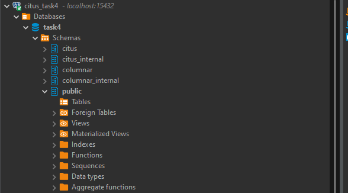
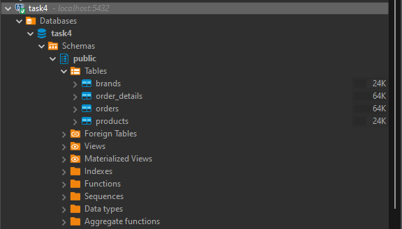

# TASK 4
1. Pertama jalankan file docker compose.yml yang sudah di konfigurasi.
2. Sambungkan postgre dan citus dengan dbeaver, dimana db dari postgre sudah ada sesuai file init.sql
3. Berikut tampilan db sebelum diingest

    Gambar isi database citus yang masih kosong dan baru dibuat

    

    Gambar isi database postgre yang baru dibuat yang sudah terdapat kolom + data

    

4. Kemudian buat file python seperti pada file postgres_to_citus.py
5. Jalankan file python dan dapat dilihat hasil ingest di database citus yang telah tadi dibuat.

    Hasil Ingest Data

    

## END